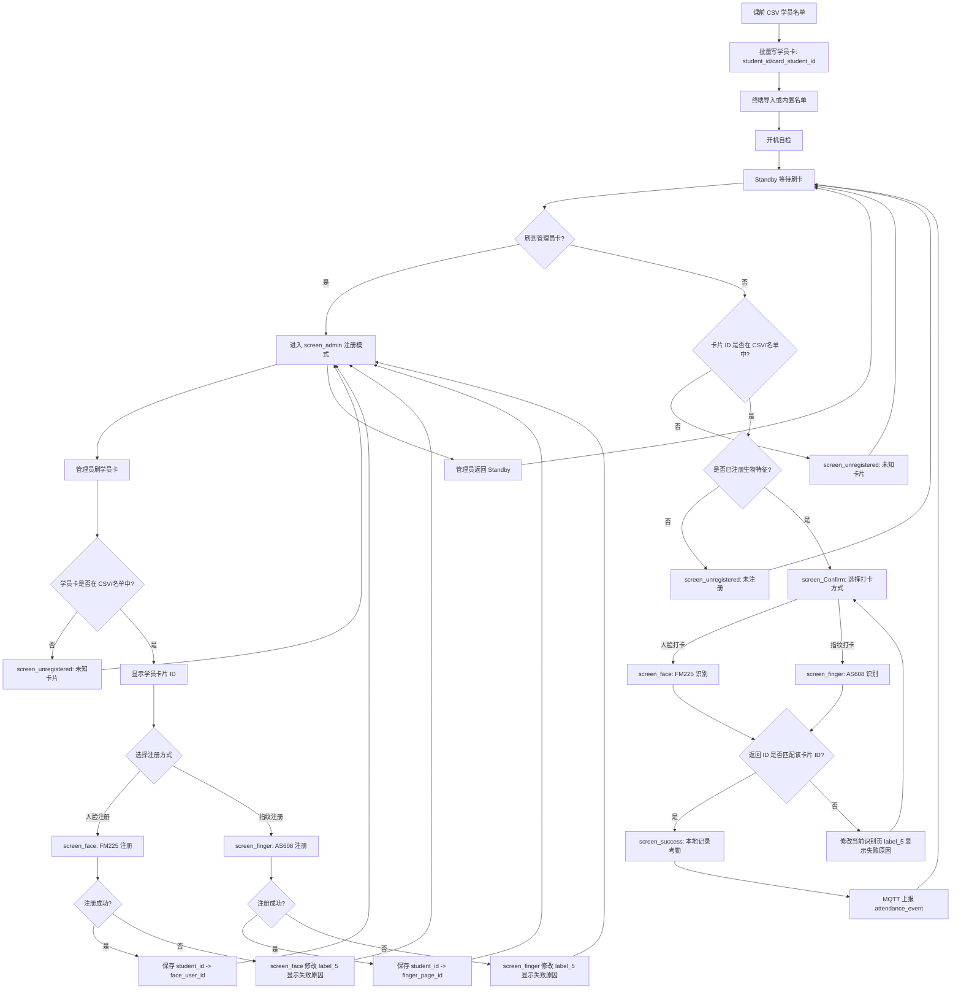

# PROJECT_ARCHITECTURE - 项目全局架构与开发指南

> 本文档面向 AI 辅助开发和后续维护。新会话开始时应先阅读本文件，再阅读 `main/app_main()` 调用链和相关组件源码。
>
> 最后更新：2026-05-12

---

## 1. 项目概要

| 项目 | 说明 |
| --- | --- |
| 名称 | 基于物联网的企业培训管理平台 - 智能终端固件 |
| 芯片 | ESP32-S3 |
| 框架 | ESP-IDF v5.4.3 |
| 语言 | C |
| 图形 | LVGL 9.x + GUI Guider 生成界面 |
| 显示 | ILI9488 SPI LCD，逻辑横屏 480x320 |
| 触摸 | XPT2046 SPI Touch |
| 网络 | WiFi STA + MQTT/OneNET |
| 身份核验 | RFID/IC 卡 + FM225 人脸模块 + AS608 指纹模块 |
| 本地存储 | NVS 保存人员档案映射；`records` SPIFFS 分区保存考勤流水 CSV |

一句话描述：终端用于企业线下培训现场的人员身份核验、考勤记录、环境数据采集和 MQTT 上报，目标业务闭环是“课前发卡/建档 -> 首次注册生物特征 -> 日常刷卡核验 -> 本地记录 -> 云端上报”。

---

## 2. 当前工程状态

当前代码已经不是早期骨架状态，已包含 UI、BSP、WiFi、MQTT、RFID、人脸、指纹、传感器和性能监控模块。

| 模块 | 状态 | 关键文件 | 说明 |
| --- | --- | --- | --- |
| 系统入口 | 已接入 | `main/main.c` | 初始化 NVS、LVGL、GUI Guider UI、网络和性能监控 |
| LVGL 显示 | 已接入 | `main/app_lvgl.c`, `components/bsp/bsp_lcd.c` | ILI9488 + esp_lvgl_port，LVGL 任务固定 Core 1 |
| GUI Guider UI | 已移植 | `components/ui_custom/` | 包含自检页和 7 个业务页面 |
| UI 事件 | 已接入核心闭环 | `components/ui_custom/events_init.c` | 接入自检、Standby、Admin、Unregistered、Confirm、Face/Finger、Success 的页面跳转和按钮桥接 |
| BSP LCD/Touch | 已接入 | `components/bsp/` | SPI LCD 与 XPT2046 触摸共用 SPI2 |
| WiFi | 已接入 | `components/app_wifi/` | STA 连接、重试、EventGroup 同步 |
| MQTT | 已接入 | `components/app_mqtt/`, `main/app_network.c` | 当前上报传感器属性；考勤事件上报待接入 |
| 时间同步 | 已接入 | `main/app_time.c` | WiFi 后 SNTP 单次对时 |
| 传感器队列 | 已接入 | `main/sensor_data.c`, `components/common/data_queue.c` | 传感器数据通过队列给网络任务 |
| DHT11 | 已启动 | `main/app_sensor.c`, `components/drivers/driver_dht.c` | GPIO6，启动后通过队列交给网络任务上报 |
| CO2 | 已接入 | `main/app_co2.c`, `components/drivers/driver_co2.c` | UART0 GPIO4/5，当前 `app_main` 未启动；启用时需释放 UART0 console |
| RFID | 已接入状态机 | `main/app_rfid.c`, `main/app_attendance.c` | 支持 RC522 I2C、读写块、刷卡回调；回调只投递业务队列，不直接操作 LVGL |
| 人脸 | 已接入注册/打卡 | `main/app_face.c`, `components/drivers/driver_fm225.c` | 支持管理员注册、日常单次识别，并与 `attendance_profile` 的 `face_user_id` 匹配 |
| 指纹 | 已接入注册/打卡 | `main/app_fingerprint.c`, `components/drivers/driver_as608.c` | 支持管理员注册、日常识别，并与 `attendance_profile` 的 `finger_page_id` 匹配 |
| 学员档案 | 已初始化 | `main/attendance_profile.c` | NVS 中保存学号、卡 UID、人脸 ID、指纹页号映射；启动时预置演示学员 |
| 考勤流水 | 已接入成功记录 | `main/attendance_record.c` | 挂载 `records` SPIFFS 分区，成功打卡追加 `/records/attendance.csv` |
| 性能监控 | 已接入 | `main/app_perf_monitor.c` | 输出任务运行时间、CPU 占用、栈水位，关注 WiFi/LVGL/UI |

重要现状：核心本地闭环已经形成：刷卡分流、管理员注册、学员确认、人脸/指纹打卡、成功页展示、本地 CSV 成功流水均已接入。MQTT 目前仍主要上报环境属性，考勤事件云端上报尚未接入。

---

## 3. 目录结构

```text
demo/
├── main/                         应用层：业务编排、任务创建、状态机
│   ├── main.c                    app_main() 系统入口
│   ├── app_lvgl.c                LVGL port + LCD/touch 接入
│   ├── app_network.c             WiFi、SNTP、MQTT、传感器数据上报
│   ├── app_rfid.c                RFID/RC522 应用封装
│   ├── app_face.c                FM225 人脸模块应用封装
│   ├── app_fingerprint.c         AS608 指纹模块应用封装
│   ├── app_attendance.c          考勤业务状态机，串联刷卡/注册/验证/UI 分流
│   ├── attendance_profile.c      学员身份映射表，NVS 持久化
│   ├── attendance_record.c       考勤成功流水，records SPIFFS CSV 持久化
│   ├── sensor_data.c             传感器队列
│   └── include/                  应用层头文件
├── components/
│   ├── ui_custom/                GUI Guider 生成 UI
│   ├── bsp/                      LCD、Touch、板级引脚
│   ├── app_wifi/                 WiFi STA 组件
│   ├── app_mqtt/                 MQTT 组件
│   ├── common/                   通用队列封装
│   └── drivers/                  DHT、CO2、AS608、FM225 等底层驱动
├── docs/
│   ├── PROJECT_ARCHITECTURE.md
│   ├── WIFI_LCD_LVGL_RESET_INVESTIGATION.md
│   └── attendance_bio_flow.drawio
├── sdkconfig
└── partitions.csv
```

依赖方向必须保持单向：

```text
main/ 应用层 -> components/ 组件层 -> ESP-IDF/第三方驱动
```

组件层不要反向依赖 `main/`。业务状态机放在 `main/`，可复用硬件能力放在 `components/` 或 `drivers/`。

---

## 4. app_main 当前启动链路

`main/main.c` 当前实际执行流程：

```text
app_main()
  ├── nvs_flash_init()
  ├── log_system_status("nvs_inited")
  ├── RFID/FM225/AS608 自检
  ├── 可选调试：CLEAR_BIOMETRIC_DB_ON_BOOT 清空 FM225/AS608 模板和本地生物绑定
  ├── app_lvgl_init()
  │   ├── bsp_lcd_init()
  │   │   ├── backlight_init()
  │   │   ├── spi_bus_initialize(SPI2_HOST)
  │   │   ├── esp_lcd_new_panel_io_spi()
  │   │   └── esp_lcd_new_panel_ili9488()
  │   ├── bsp_touch_init()
  │   ├── lvgl_port_init()
  │   ├── lvgl_port_add_disp()
  │   ├── lvgl_port_add_touch()
  │   └── bsp_lcd_backlight_set(80)
  ├── lvgl_port_lock()
  │   ├── setup_ui(&guider_ui)
  │   │   ├── init_scr_del_flag()
  │   │   ├── setup_scr_screen()
  │   │   └── lv_screen_load(自检页)
  │   └── events_init(&guider_ui)
  ├── events_set_admin_*_callback(...)
  ├── events_set_confirm_*_callback(...)
  ├── events_selfcheck_set_result(...)
  ├── events_selfcheck_finish()
  │   └── 通过 LVGL timer/async 延迟进入 Standby
  ├── app_sensor_start()
  ├── app_attendance_start()
  │   ├── attendance_profile_init()
  │   ├── seed_demo_profiles()
  │   ├── attendance_profile_dump()
  │   ├── attendance_record_init()
  │   ├── app_rfid_set_card_callback()
  │   ├── app_rfid_start()
  │   └── attendance_task(Core 1)
  ├── app_network_start()
  │   └── network_task(Core 0)
  │       ├── app_wifi_init()
  │       ├── app_wifi_wait_connected()
  │       ├── app_time_sync_once()
  │       ├── app_mqtt_start()
  │       └── 循环读取 sensor_queue 并上报属性
  ├── app_perf_monitor_start() 当前按调试需要启停
  └── app_main 返回
```

当前启动链路注意事项：

- `main.c` 只保留系统初始化和 UI 回调桥接，具体考勤业务进入 `app_attendance.c`。
- RFID 回调进入 `app_attendance` 队列，不能在硬件回调里直接调用 LVGL。
- `attendance_record_init()` 挂载 `records` SPIFFS 分区；若失败，UI 成功页不阻塞，但日志必须报错。
- `CLEAR_BIOMETRIC_DB_ON_BOOT` 当前是调试开关；正常演示前应确认是否需要关闭，避免每次上电清空已注册模板。
- MQTT 当前主要上报环境属性，考勤事件上报尚未接入。

---

## 5. GUI Guider UI 页面

`components/ui_custom/gui_guider.h` 中实际包含 9 个 screen，其中 1 个启动自检页，8 个业务页。

| 页面 | 代码对象 | 角色 |
| --- | --- | --- |
| 自检页 | `screen` | 启动时显示 RFID/Face/Finger/Network 自检状态 |
| 待机页 | `screen_Standby` | 日常等待刷卡，显示时间、设备状态、最近结果 |
| 确认页 | `screen_Confirm` | 刷卡后显示学号/卡信息，让学员选择人脸或指纹验证 |
| 人脸页 | `screen_face` | 人脸验证进行中，显示学号和超时提示 |
| 指纹页 | `screen_finger` | 指纹验证进行中，显示学号和超时提示 |
| 成功页 | `screen_success` | 打卡成功，显示学号、卡号、打卡时间，8 秒后自动返回 Standby |
| 未注册/失败页 | `screen_unregistered` | 卡未注册、未绑定、验证失败或非本人 |
| 管理员页 | `screen_admin` | 管理员/注册流程，选择注册人脸或指纹 |
| 考勤记录页 | `screen_records` | 管理员查看设备本地最近考勤流水 |

当前 UI 事件接入情况：

- 已接入：自检页返回按钮、自检结束后延迟进入 Standby。
- 已接入：Standby 真实时间、WiFi 状态、环境数据显示。
- 已接入：Admin 返回、写卡模式、人脸注册、指纹注册、查看考勤记录按钮。
- 已接入：Unregistered 返回按钮和 3 秒自动返回，支持返回 Standby 或 Admin。
- 已接入：Confirm 返回、人脸打卡、指纹打卡按钮。
- 已接入：Success 返回按钮和 8 秒自动返回；页面只展示“Check-in OK”、学号、卡号、打卡时间，不在成功页标题里显示 `face` / `fingerprint`。
- 已接入：Records 页面从 `/records/attendance.csv` 读取最近成功记录，使用 LVGL 表格显示时间、学号和打卡方式；当前读取最近 20 条，表格区域可上下滚动，支持清空本地考勤记录，返回后回到 Admin。

---

## 6. 业务闭环设计

### 6.1 你的业务设想是否合理

结论：作为毕设和企业线下培训终端原型，你的想法是合理的。用“学号/学员卡片 ID”作为业务唯一标识，比直接上传卡片物理 UID 更直观，也方便 MQTT 上报和平台展示。

但需要区分两个概念：

- 物理 UID：卡片芯片自身 UID，普通卡通常不可改，特殊 UID 卡可改。
- 卡内学号：写入 MIFARE 数据块的学号字符串，是业务标识。

建议工程上以后统一叫 `student_id` 或 `card_student_id`，不要把写进卡里的学号继续叫 `uid`。毕设可以不展开 ID 卡克隆问题，但字段命名要清楚，否则后面 RFID 驱动、档案表、MQTT 字段会混乱。

### 6.2 管理员卡分流规则

Standby 界面只做一件事：等待刷卡。系统通过卡片类型决定进入注册流程还是考勤流程。

| 刷到的卡 | 系统动作 |
| --- | --- |
| 管理员卡 | 进入 `screen_admin`，开启注册模式 |
| 学员卡，存在于 CSV/本地名单且已绑定至少一种生物特征 | 进入 `screen_Confirm`，选择人脸或指纹打卡 |
| 学员卡，存在于 CSV/本地名单但未绑定生物特征 | 进入 `screen_unregistered`，提示“未注册” |
| 未出现在 CSV/本地名单 | 进入 `screen_unregistered`，提示“未知卡片” |

管理员卡不参与考勤，只负责把系统从 Standby 切到注册模式。注册模式下，管理员再刷学员卡，系统读取学员卡片 ID，检查它是否在 CSV/本地名单中，然后允许注册人脸或指纹。

### 6.3 推荐数据模型

当前 `attendance_profile_t` 思路仍然有用，不建议删除，而是建议改名/瘦身为“学员身份映射表”。

最小字段：

| 字段 | 含义 |
| --- | --- |
| `student_id` | 学号，业务唯一主键 |
| `face_user_id` | FM225 返回的人脸用户 ID |
| `finger_page_id` | AS608 指纹库页号 |
| `has_face_bound` | 是否已绑定人脸 |
| `has_finger_bound` | 是否已绑定指纹 |

可选字段：

| 字段 | 含义 |
| --- | --- |
| `card_uid` | 物理 UID，调试或防重复用 |
| `name` | 姓名，当前可不用 |
| `updated_at` | 最近绑定时间 |

存储建议：

- 终端本地：NVS 保存映射表，适合毕设和小规模人员，当前 `attendance_profile.c` 的方式可继续用。
- 企业真实系统：服务器/后台数据库是权威数据源，终端本地只做缓存；终端离线时先本地记录，联网后补传。
- 不建议仅保存在 RAM；断电会丢失注册关系。

---

# 7. 业务流程图



### 7.1 Standby 分流状态机

```text
Standby
  └── 刷卡
      ├── 管理员卡 -> screen_admin
      ├── 学员卡在 CSV/名单中
      │   ├── 已注册 -> screen_Confirm
      │   └── 未注册 -> screen_unregistered("未注册")
      └── 学员卡不在 CSV/名单中 -> screen_unregistered("未知卡片")
```

### 7.2 管理员写卡模式

管理员页右下角提供“写卡模式”按钮。点击后业务状态机进入一次批量写卡会话，后续刷卡不走 Standby 考勤分流，而是按物理 UID 到 NVS 档案表查询对应学号，查到才写入 MIFARE block 4 并读回校验。

```text
screen_admin
  └── 点击“写卡模式”
      └── 进入 card_write_mode
          ├── 刷管理员卡 -> 不写入，提示跳过
          ├── 刷未知卡 -> 不写入，提示未知卡片
          └── 刷 NVS 中存在的学员卡
              ├── 写入 block 4: student_id
              ├── 读回 block 4 校验
              ├── 成功 -> 显示 Write OK n/3
              └── 三张预置学员卡写完 -> 自动退出 card_write_mode，留在 screen_admin
```

写卡模式的权威数据源是 NVS 中的 `attendance_profile`。卡内 block 4 只保存学号副本，不能反过来作为写入目标判断依据；这样可以避免旧测试数据（例如 `Hello RC522...`）导致误写或误分流。

### 7.3 注册状态机

```text
screen_admin
  └── 管理员刷学员卡
      ├── 不在 CSV/名单中 -> screen_unregistered("未知卡片") -> screen_admin
      └── 在 CSV/名单中 -> 显示学员卡片 ID
          ├── 选择 Face Register -> screen_face
          │   ├── 注册成功 -> 保存 face_user_id -> 修改提示 -> screen_admin
          │   └── 注册失败 -> 修改 label_5 显示失败原因 -> screen_admin
          └── 选择 Finger Register -> screen_finger
              ├── 注册成功 -> 保存 finger_page_id -> 修改提示 -> screen_admin
              └── 注册失败 -> 修改 label_5 显示失败原因 -> screen_admin
```

### 7.4 正常考勤状态机

```text
Standby
  └── 学员刷卡且已注册 -> screen_Confirm
      ├── 选择 Face -> screen_face
      │   ├── 识别成功且 face_user_id 匹配 -> 追加 /records/attendance.csv -> screen_success -> 8s 后 Standby
      │   └── 失败/超时/不是本人 -> 修改 label_5 -> screen_Confirm
      └── 选择 Finger -> screen_finger
          ├── 识别成功且 finger_page_id 匹配 -> 追加 /records/attendance.csv -> screen_success -> 8s 后 Standby
          └── 失败/超时/不是本人 -> 修改 label_5 -> screen_Confirm
```

打卡成功页说明：

- `screen_success` 显示学号、卡 UID、打卡时间和统一成功标题 `Check-in OK`。
- 识别方式 `face` / `fingerprint` 不显示在成功页标题中，避免界面信息过杂；该字段仍保留在本地 CSV 和后续 MQTT 事件中，便于追溯统计。
- 成功页 8 秒后自动返回 Standby；用户点击返回按钮可立即返回 Standby。

### 7.5 本地考勤流水

本地考勤流水不放 NVS。NVS 只保存人员档案和绑定关系，流水记录写入 `partitions.csv` 中预留的 `records` SPIFFS 分区。

| 项目 | 说明 |
| --- | --- |
| 挂载点 | `/records` |
| 分区标签 | `records` |
| 文件路径 | `/records/attendance.csv` |
| 写入时机 | 人脸或指纹打卡成功，且返回 ID 与当前卡片档案绑定值匹配 |
| 当前记录范围 | 只追加成功记录；失败记录暂只打印日志 |
| 屏幕查看 | 管理员页点击 `Records`，进入 `screen_records` 查看最近 20 条，表格区域可上下滚动，并可点击清空按钮重置记录文件 |

CSV 表头：

```csv
ts,time,student_id,card_uid,method,result,reason,face_user_id,finger_page_id
```

运行日志会打印关键状态：

```text
records SPIFFS mounted total=... used=...
created attendance record CSV: /records/attendance.csv
attendance record appended student_id=... card=... method=...
attendance record read recent count=... path=/records/attendance.csv
```

注意：`/records/attendance.csv` 是 ESP32 设备 SPIFFS 文件系统里的运行时文件，不是工程目录下的普通 CSV。当前支持在设备屏幕上通过 LVGL 表格查看最近 20 条成功考勤记录，并可在表格区域上下滚动；管理员可在记录页点击清空按钮重写 CSV 表头并删除已有流水。若要在电脑端拿到完整 CSV，仍需要后续增加导出接口、串口 dump 命令或文件系统读取工具。工程目录下的 `docs/attendance_profiles_seed.csv` 仅适合作为可查看的静态名单源/答辩展示资料；设备当前真实档案仍以 NVS dump 和运行时记录为准。

---

# 8. 真实企业线下培训通常怎么做

真实企业系统一般不会只靠终端自己维护全部名单，而是分为后台和终端两层：

1. 培训前，管理员在后台导入 CSV/Excel 名单，生成培训批次、课程、学员和权限。
2. 发卡环节把员工号/学号写入卡，或把卡号绑定到后台人员档案。
3. 首次到场时做身份采集：人脸、指纹、照片或签字，并绑定到人员档案。
4. 日常上课时，先做“卡/二维码/工号”快速定位人员，再做人脸或指纹确认本人。
5. 终端先本地落地记录，再上传服务器，避免网络波动导致考勤丢失。
6. 后台生成签到率、迟到早退、课程完成度、考试结果、评价等统计。

你的毕设可以简化为：CSV 名单 + 写卡学号 + 本地 NVS 映射 + `records` 分区 CSV 成功流水 + MQTT 上报学号。这个闭环对演示足够清楚。

---

# 9. MQTT 上报建议

当前 `main/app_network.c` 上报的是 OneNET 属性主题：

```text
$sys/{pid}/{device-name}/thing/property/post
```

考勤建议使用事件模型，事件标识符：

```text
attendance_event
```

推荐字段：

| 字段 | 类型 | 说明 |
| --- | --- | --- |
| `student_id` | string | 学号，主展示字段 |
| `method` | string | `face` / `fingerprint` |
| `result` | string | `ok` / `fail` |
| `reason` | string | `matched` / `not_registered` / `not_owner` / `timeout` / `module_error` |
| `face_user_id` | int | 人脸 ID，可选 |
| `finger_page_id` | int | 指纹页号，可选 |
| `ts` | int64 | Unix 毫秒时间戳 |
| `device_id` | string | 设备 ID，可选 |

最小事件示例：

```json
{
  "id": "1",
  "version": "1.0",
  "params": {
    "attendance_event": {
      "value": {
        "student_id": "202401001",
        "method": "face",
        "result": "ok",
        "reason": "matched",
        "face_user_id": 12,
        "ts": 1776001234000
      },
      "time": 1776001234000
    }
  }
}
```

---

# 10. 硬件引脚

当前 BSP 引脚定义在 `components/bsp/include/bsp_pin_defs.h`。

| 外设 | 信号 | GPIO |
| --- | --- | --- |
| LCD/Touch SPI2 | MOSI | GPIO38 |
| LCD/Touch SPI2 | MISO | GPIO41 |
| LCD/Touch SPI2 | CLK | GPIO39 |
| LCD | CS | GPIO7 |
| LCD | DC | GPIO15 |
| LCD | RST | GPIO18 |
| LCD | Backlight | GPIO40 |
| Touch | CS | GPIO42 |
| Touch | INT | NC |
| RFID RC522 I2C | SDA | GPIO20 |
| RFID RC522 I2C | SCL | GPIO21 |
| FM225 | UART1 TX/RX | GPIO11/GPIO10 |
| AS608 | UART2 TX/RX | GPIO17/GPIO16 |
| DHT11 | DATA | GPIO6 |
| CO2 | UART0 TX/RX | GPIO4/GPIO5 |

注意：

- LCD CS/DC/RST 已从高风险外部存储相关 GPIO 调整到 GPIO7/GPIO15/GPIO18。
- SPI 总线和背光仍使用 GPIO38/39/40/41/42，需结合实际 ESP32-S3 模组手册确认这些高号 GPIO 是否被 Flash/PSRAM/板载功能占用。
- UART 分配已经拆开：FM225 使用 UART1，AS608 使用 UART2，CO2 预留 UART0。
- 当前 `sdkconfig` 仍以 UART0 作为主 console；若要启用 CO2，必须通过 `idf.py menuconfig` 将 console 切到 USB Serial/JTAG，释放 UART0 给 CO2。

---

# 11. sdkconfig 与内存策略

当前 LVGL 内存策略建议：

```text
# CONFIG_LV_USE_BUILTIN_MALLOC is not set
CONFIG_LV_USE_CLIB_MALLOC=y
CONFIG_LV_USE_BUILTIN_STRING=y
CONFIG_LV_USE_BUILTIN_SPRINTF=y
```

说明：

- LVGL 使用 C library malloc 是合理的，可走 ESP-IDF heap 能力。
- 不要同时启用多个 LVGL malloc 后端。
- `sdkconfig` 应通过 `idf.py menuconfig` 维护，不建议手写修改后忘记同步。

显示缓冲注意：

- `main/app_lvgl.c` 当前 LVGL draw buffer 使用 `.buff_dma = true`，缓冲区较小，为 10 行。
- ILI9488 18bpp 转换由 panel 驱动内部转换缓冲处理。
- 后续若 UI 图片和页面继续增大，可评估 LVGL draw buffer 放 PSRAM、LCD 转换/传输缓冲保留 DMA 内存的方案。

---

# 12. 任务与核心分配

| 任务/子系统 | 推荐 Core | 当前情况 |
| --- | --- | --- |
| WiFi/MQTT/network_task | Core 0 | `app_network.c` 固定 Core 0 |
| LVGL task | Core 1 | `app_lvgl.c` `task_affinity = 1` |
| UI 业务状态机 | Core 1 + LVGL lock/async | `app_attendance.c` 固定创建 `attendance_task`，UI 操作经 `events_init.c` 桥接 |
| RFID 扫描 | Core 1 优先 | RC522 回调投递到 `app_attendance` 队列 |
| 人脸/指纹串口业务 | Core 1 优先 | 已接入管理员注册和 Confirm 打卡验证 |
| perf_monitor | Core 1 | 已固定 Core 1 |
| DHT/CO2 | Core 1 | 任务代码已固定 Core 1，当前未启动；CO2 启用前需释放 UART0 console |

规则：

- WiFi/MQTT 尽量留在 Core 0。
- LVGL API 必须在 LVGL 上下文中调用，或通过 `lvgl_port_lock()`/`lv_async_call()` 保护。
- RFID/人脸/指纹回调不要直接长时间阻塞 LVGL 任务；建议通过队列把业务事件交给专门状态机任务。

---

# 13. 考勤状态机实现边界

当前已经新增 `main/app_attendance.c` 和 `main/include/app_attendance.h`，作为考勤业务状态机唯一入口。

职责：

- 初始化 `attendance_profile`。
- 预置演示学员档案并通过 `attendance_profile_dump()` 打印 NVS 当前状态。
- 初始化 `attendance_record`，挂载 `records` SPIFFS 分区。
- 启动 RFID。
- 绑定刷卡回调。
- 管理当前活动学员 `student_id`。
- 识别管理员卡并切换注册模式。
- 串联注册、验证、Confirm、Success、Unregistered 页面。
- 成功打卡后追加 `/records/attendance.csv`。
- 对 UI 更新统一使用 LVGL lock/async。

当前主要接口：

```c
esp_err_t app_attendance_start(void);
esp_err_t app_attendance_enter_card_write_mode(void);
esp_err_t app_attendance_exit_card_write_mode(void);
esp_err_t app_attendance_exit_admin_mode(void);
esp_err_t app_attendance_register_face_selected(void);
esp_err_t app_attendance_register_fingerprint_selected(void);
esp_err_t app_attendance_verify_face_selected(void);
esp_err_t app_attendance_verify_fingerprint_selected(void);
esp_err_t app_attendance_confirm_return(void);
```

不要把业务状态机继续堆在 `main.c` 或 `components/ui_custom/events_init.c` 里。`events_init.c` 只适合绑定 UI 控件事件，把事件转发给 `app_attendance`。

---

# 14. 开发规范摘要

1. `main/` 是应用层，负责业务编排；`components/` 是可复用组件层。
2. 对外 API 优先返回 `esp_err_t`。
3. 内部函数和模块变量使用 `static`。
4. 任务使用 `xxx_start()` 统一创建，并防止重复启动。
5. 模块间通信优先使用 Queue、EventGroup、callback，避免裸全局变量互相读写。
6. `app_main()` 不写死循环，完成初始化后返回。
7. 所有可失败调用检查返回值。
8. UI 页面生成代码尽量少改；业务逻辑放在独立应用模块。
9. 硬件引脚集中在 BSP 或对应模块配置处维护，不要在多个文件散落硬编码。
10. 调试记录中已证伪的猜想不要继续当结论引用，保留为排查历史即可。

---

# 15. 已知缺口

- `attendance_profile` 当前字段仍包含 `uid` 和 `name`，与“直接读卡内学号”方案不完全贴合，建议后续重命名或新增 `student_id` 主键模型。
- 考勤事件 MQTT 上报未实现。
- 本地考勤流水当前只记录成功打卡；失败、超时、非本人等审计流水后续可扩展。
- `/records/attendance.csv` 已支持管理员在屏幕通过 LVGL 表格查看最近 20 条，并可上下滚动；若需要电脑端查看完整 CSV，需要后续增加导出接口、串口 dump 命令或文件系统读取工具。
- `CLEAR_BIOMETRIC_DB_ON_BOOT` 是调试开关，正常演示前应确认是否关闭，避免上电清空 FM225/AS608 模板和本地绑定。
- CO2 已从 UART1 调整到 UART0；启用 CO2 前仍需把 console 从 UART0 切到 USB Serial/JTAG。
- 高号 GPIO 仍需按实际模组手册复核。
